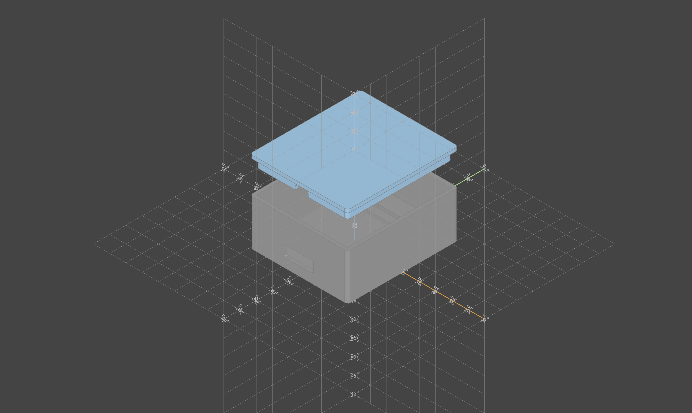

# ESP-Presence

ESP32-C6 SuperMini-based presence detection system with mmWave radar sensors and custom 3D-printed cases.

## Overview

This project combines:
- **ESP32-C6 SuperMini** microcontroller
- **LD2410C** or **SEN0610 (C4001)** mmWave presence sensors  
- **3D-printable cases** designed in build123d/CadQuery
- **ESPHome** configurations for Home Assistant integration

## Components

### ESPHome Configurations
- `esp32c6-ld2410c.yaml` - Configuration for LD2410C sensor
- `esp32c6-sen0610.yaml` - Configuration for SEN0610 (C4001) sensor

### 3D Cases
Cases are modeled using **build123d** and **CadQuery** frameworks:
- **LD2410C case**: `ld2410c/` - Compact enclosure for ESP32-C6 + LD2410C
- **SEN0610 case**: `sen0610/` - Enclosure for ESP32-C6 + SEN0610 sensor
  - STL files: `enclosure_base.stl`, `enclosure_lid.stl`, `corner_holder.stl`
  - Assembly preview:
  


## Project Structure
```
esp-presence/
├── esp32c6-ld2410c.yaml    # ESPHome config for LD2410C
├── esp32c6-sen0610.yaml    # ESPHome config for SEN0610
├── ld2410c/                # LD2410C case (build123d/CadQuery)
└── sen0610/                # SEN0610 case (build123d)
    └── images/assembly.png # Assembly visualization
```

## Requirements
- Python 3.11+ (3.13+ for sen0610 case)
- build123d
- CadQuery (for ld2410c case)
- ESPHome